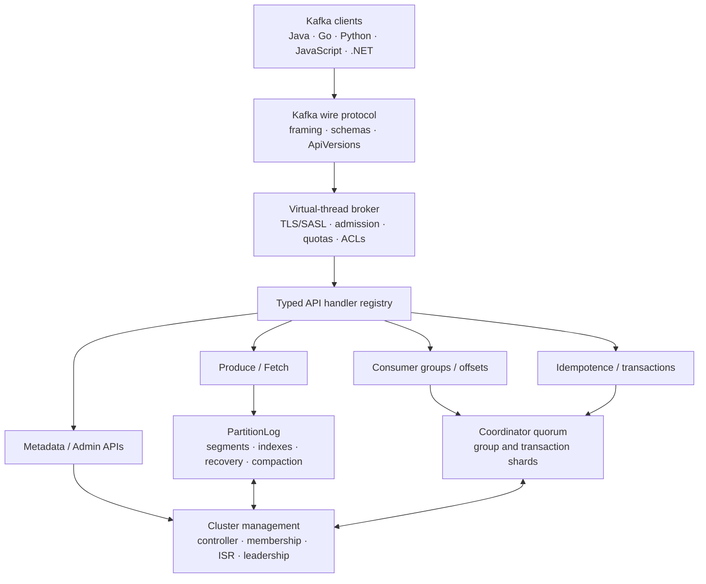

# Cascade

<p align="center">
  
</p>

> **A Kafka-wire-compatible distributed streaming log I built from scratch in Scala 3.**

Cascade accepts real Kafka protocol frames over TCP. Existing Java, JavaScript, Python, Go, and .NET clients can produce, consume, administer topics, coordinate groups, and recover offsets without a Cascade-specific SDK.

I built the broker itself with Scala 3 and the JDK. Apache Kafka's Java client is a test-only dependency that verifies compatibility from outside the implementation.

## What this project demonstrates

| Capability | Implemented evidence |
| --- | --- |
| Kafka wire protocol | Explicit API/version contract, malformed-frame fuzzing, and five external client languages |
| Persistent storage | Segmented magic-v2 logs, indexes, checksums, crash-tail repair, retention, and compaction |
| Delivery semantics | Idempotent producers, sequence recovery, transactions, transactional offsets, and `read_committed` |
| Distributed operation | ISR replication, committed high watermarks, leader failover, controller election, and reassignment |
| Consumer coordination | Classic groups plus `ConsumerGroupHeartbeat` v0-v1 and cooperative server assignment |
| Security | TLS 1.2/1.3, PLAIN, SCRAM, OAUTHBEARER, ACLs, auditing, peer mTLS, and secret rotation |
| Resource isolation | Connection/request admission and exact cluster-wide per-principal quotas with idle-capacity reclamation |
| Operations | Prometheus, health/readiness, structured events, backup/restore, Docker, and Kubernetes |

The latest complete source qualification passed **577/577** unit, integration, Kafka-client, fault, security, storage, and end-to-end tests in **156 seconds**. The latest ten-million-record regression verified **10,000,000/10,000,000** records. These are development-machine results with documented boundaries, not claims of universal production capacity.

> [!IMPORTANT]
> Cascade is not yet a production replacement for Apache Kafka. The [production-readiness checklist](docs/production-readiness.md) keeps the remaining multi-day, physical-device, cross-version-image, and dedicated-host gates explicit.

## Architecture



The [architecture guide](docs/architecture.md) contains a three-node replication/failover diagram, component boundaries, and the request and acknowledgement paths.

## Quick start

Requirements: Docker with Compose, or JDK 21 plus sbt.

```bash
docker compose up --build
```

The broker listens on `localhost:9092`. Any compatible Kafka client can connect:

```properties
bootstrap.servers=localhost:9092
acks=all
enable.idempotence=true
```

For a local three-broker RF=3 cluster:

```bash
docker compose -f compose.cluster.yaml up --build
```

I use named volumes for broker data. I stop brokers gracefully before removing containers, and I do not treat a container volume as a backup.

## Leader-failover demo

The demo runs three brokers, creates an RF=3 topic, starts one idempotent `acks=all` producer, discovers the real leader, issues `docker kill` against that leader, continues with the same producer, and verifies every acknowledged value.

```powershell
./sbt.bat Test/compile
./scripts/run-failover-demo.ps1 -Image miladsade96/cascade:1.8.0 -Records 100000 `
  -Java 'C:\Program Files\Eclipse Adoptium\jdk-21\bin\java.exe'
```

It archives JSON beneath `artifacts/` and prints only measured values:

```text
Current leader: broker-1
Acknowledged before failure: 50000
Killed leader: broker-1
New leader: broker-2
Acknowledged after recovery: 100000
FAILOVER_RESULT { ... "lost":0,"unexpected_duplicates":0,"failover_ms":... }
```

I do not put sample throughput or failover numbers in this section until the exact release image produces them.

## Kafka compatibility

Cascade advertises only versions it implements and tests. It does not pretend to support the entire Kafka surface.

| API | Key | Versions | Coverage |
| --- | ---: | ---: | --- |
| Produce | 0 | 3 | `acks` 0/1/all, idempotence, transactional batches |
| Fetch | 1 | 6 | High watermark, last stable offset, `read_committed` |
| ListOffsets | 2 | 2 | Earliest/latest offsets |
| Metadata | 3 | 4 | Broker/topic/partition discovery |
| OffsetCommit | 8 | 5-10 | Classic and modern member fencing, flexible schemas |
| OffsetFetch | 9 | 4-10 | Requested/all and multi-group acknowledged reads |
| FindCoordinator | 10 | 2 | Group and transaction routing |
| JoinGroup / Heartbeat / LeaveGroup / SyncGroup | 11-14 | 5 / 3 / 2 / 3 | Classic group lifecycle |
| DescribeGroups / ListGroups | 15-16 | 0-4 / 0-5 | Acknowledged group administration |
| SaslHandshake / SaslAuthenticate | 17 / 36 | 1 | PLAIN, SCRAM-256/512, OAUTHBEARER |
| ApiVersions | 18 | 0-4 | Legacy and flexible response schemas |
| CreateTopics | 19 | 2 | Quorum-committed topic creation |
| InitProducerId | 22 | 0-5 | Durable IDs, retries, and fencing |
| AddPartitionsToTxn | 24 | 0-5 | Enrollment and verify-only admission |
| AddOffsetsToTxn / EndTxn / TxnOffsetCommit | 25 / 26 / 28 | 0-4 | Transactional consumer offsets and outcomes |
| DescribeAcls / CreateAcls / DeleteAcls | 29-31 | 1 | Kafka ACL administration |
| DescribeConfigs | 32 | 2 | Non-sensitive broker/topic configuration |
| DeleteGroups | 42 | 0-2 | Empty-group and offset deletion |
| IncrementalAlterConfigs | 44 | 0 | Topic retention/cleanup changes |
| Alter/ListPartitionReassignments | 45-46 | 0 | Online replica movement |
| OffsetDelete | 47 | 0 | Protected selected-offset deletion |
| DescribeQuorum | 55 | 0-2 | Controller epoch, voters, endpoints |
| DescribeProducers | 61 | 0 | Producer state inspection |
| DescribeTransactions / ListTransactions | 65-66 | 0 / 0-2 | Transaction administration |
| ConsumerGroupHeartbeat / Describe | 68-69 | 0-1 | Modern group protocol and assignment |
| AddRaftVoter / RemoveRaftVoter | 80-81 | 0-1 / 0 | Durable joint-consensus membership |

### Tested client matrix

| Client | Produce | Consume | Admin | Groups/offsets | Transactions/security |
| --- | :---: | :---: | :---: | :---: | :---: |
| Apache Kafka Java 4.3.1 | ✅ | ✅ | ✅ | ✅ | ✅ |
| KafkaJS 2.2.4 | ✅ | ✅ | ✅ | ✅ | Not in external smoke |
| confluent-kafka Python 2.15.0 | ✅ | ✅ | ✅ | Assigned consumer | Not in external smoke |
| franz-go 1.21.0 | ✅ | ✅ | ✅ | ✅ | Not in external smoke |
| Confluent.Kafka .NET 2.15.0 | ✅ | ✅ | ✅ | ✅ | Not in external smoke |

The [external client matrix](compatibility/README.md) explains exactly what each check does. “Not in external smoke” means I have not marked that cell as supported evidence; it is not converted into a checkmark based on assumption.

## Storage engine

- Kafka magic-v2 batches stay serialized and compressed on the normal data path.
- Each partition assigns offsets under one serialization boundary and writes with positional file I/O.
- Segment, timestamp, transaction, and high-watermark state recover after restart.
- CRC32C journals truncate incomplete/corrupt tails conservatively.
- Time/size retention retires only safe closed segments through atomic rename.
- Compaction rewrites uncompressed/gzip keyed records, preserves tombstone grace, and leaves unsupported/control/transactional batches opaque.
- `periodic` flushing batches force operations; `sync` forces every local append.

## Replication and leader election

- Replicas and ISR are stored in quorum metadata.
- `acks=all` requires `min.insync.replicas` and every current ISR append before the committed high watermark advances.
- Controller votes and terms are forced to a durable journal.
- A majority elects and fences controllers; isolated leaders lose their lease.
- Failed partition leaders are removed from ISR and a surviving ISR replica is promoted with a new leader epoch.
- Returning replicas repair divergent tails before rejoining ISR.
- Online reassignment uses adding/removing replicas and finalizes only after the target catches up.

## Consumer groups

I support classic Join/Sync/Heartbeat groups and Kafka's server-assigned consumer protocol. Modern membership persists member epochs, target/current assignments, static identity, explicit or regex subscriptions, and committed offsets. Coordinator ownership uses rendezvous hashing, while acknowledged immutable views keep reads off mutable coordinator monitors.

See [consumer group administration](docs/group-administration.md) and the [consumer-protocol qualification](docs/performance/2026-09-13-consumer-protocol.md).

## Transactions and delivery semantics

Producer IDs, epochs, duplicate windows, sequence state, active ranges, outcomes, transaction timeouts, and transactional offsets are durable. A successor coordinator can resolve a certified in-doubt decision. Fetch computes last stable offsets and filters aborted/open data for `read_committed` consumers.

See [delivery semantics](docs/delivery-semantics.md) and its [qualification report](docs/performance/2026-09-14-delivery-semantics.md).

## Security and isolation

- TLS 1.2/1.3 and optional client certificates.
- Kafka PLAIN, SCRAM-SHA-256/512, and signed OAUTHBEARER JWTs.
- RSA, EC, and Ed25519 JWKS validation with issuer, audience, time, scope, and role mapping.
- Deny-by-default topic/group/transaction/cluster ACLs with Kafka Admin APIs.
- Forced JSONL audit events and atomic credential, JWKS, TLS, peer-identity, and ACL reload.
- Hostname-verified peer mTLS with claimed-node binding.
- Bounded connections, requests, frames, queues, and exact cluster-wide quotas.

## Benchmarks

My historical single-node heavy-load regression used Java 21, 1 KiB deterministic payloads, eight partitions, four producers, four consumers, LZ4, `acks=all`, and periodic flushing.

| Workload | Produce | Consume | Verification |
| --- | ---: | ---: | ---: |
| 10,000,000 records, latest historical regression | 368,387 records/s | 351,784 records/s | 10,000,000/10,000,000 |
| 10,000,000 records, sustained disk-bound run | 182,285 records/s | 473,058 records/s | 10,000,000/10,000,000 |
| 1,000,000 records, calibration | 614,413 records/s | 556,232 records/s | 1,000,000/1,000,000 |

These runs share a development machine and some share the broker/client JVM. They are regression evidence, not an Apache Kafka comparison or RF=3/TLS production sizing result. The [heavy-load report](docs/performance/2026-08-05-heavy-load.md) records hardware, latency, CPU, GC, heap, storage, flushing, and methodology.

For a same-client, same-container-limit, same-payload comparison against the official Apache Kafka image:

```powershell
./scripts/compare-kafka.ps1 -CascadeImage miladsade96/cascade:1.8.0 `
  -KafkaImage apache/kafka:4.3.1 -Records 250000
```

The harness uses the same Java client code, record count, warm-up, payload, partitions, replication factor, producers, compression, `acks`, container CPU, and memory limit. I publish both results even when Kafka wins.

## Failure and recovery testing

The repository tests:

- leader, controller, coordinator, and process loss;
- deterministic directional network partitions and protocol-message drops;
- force-kill restart and torn data/journal tails;
- stale terms, stale metadata images, quorum loss, and joint-consensus failure;
- disk reserve rejection without offset movement;
- TLS trust/key and peer-identity rotation during replicated traffic;
- transaction and committed-offset recovery after failover;
- exact record, offset, producer epoch, and transaction visibility.

The [qualification guide](docs/qualification.md) lists focused commands. The full suite is:

```bash
./sbt test
```

## Operations and deployment

- Prometheus metrics with bounded labels, alerts, and a Grafana dashboard.
- Separate liveness, readiness, and authenticated status endpoints.
- Structured rotating events and capacity alert/resolution events.
- Checksummed backup verification and restore, plus local online write barriers.
- Non-root, read-only, capability-dropped container with a module-limited Java 21 runtime.
- Three-broker Compose and Kubernetes StatefulSets, disruption budgets, anti-affinity, NetworkPolicies, and ServiceMonitor resources.

See [container operations](docs/containers.md), [operations](docs/operations.md), and [backup/restore](docs/backup-restore.md).

## Design documents

I record consequential design choices as ADRs rather than leaving them implicit:

1. [Kafka wire protocol](docs/adr/0001-kafka-wire-protocol.md)
2. [Segmented log storage](docs/adr/0002-segmented-log-storage.md)
3. [Replication model](docs/adr/0003-replication-model.md)
4. [Controller election](docs/adr/0004-controller-election.md)
5. [Idempotent producers](docs/adr/0005-idempotent-producers.md)
6. [Consumer-group coordination](docs/adr/0006-consumer-group-coordination.md)
7. [Transactions](docs/adr/0007-transactions.md)
8. [Virtual-thread networking](docs/adr/0008-virtual-thread-networking.md)

## Production readiness

What I will not claim yet:

- no completed 72-hour authenticated multi-tenant soak on release hardware;
- no physical host-power or storage-device-loss qualification;
- no dedicated-host RF=3/TLS capacity envelope;
- no coordinated cluster-wide snapshot artifact across replica hosts;
- no compressed-record rewriting for Snappy/LZ4/Zstd compaction;
- no full Kafka API or transaction-protocol-V2 parity;
- no exhaustive published-image rolling matrix across every adjacent release.

The [production-readiness document](docs/production-readiness.md) maps capabilities to evidence, missing gates, and roadmap. I prefer a precise limitation over a misleading “Kafka replacement” label.

## Roadmap

1. Run and archive the 72-hour authenticated multi-tenant soak and real power/device-loss campaign.
2. Publish dedicated-host RF=3/TLS capacity and failover envelopes.
3. Complete coordinated cross-host snapshots and scheduled off-host retention.
4. Add Snappy/LZ4/Zstd compaction rewriting and replicated cleanup coordination.
5. Expand client-version and adjacent-release rolling matrices.
6. Pursue zero-copy Fetch, multi-device placement, and worker-pool changes only when profiles justify them.

## Build and contribute

```bash
./sbt test
./sbt stage
```

See [CONTRIBUTING.md](CONTRIBUTING.md). Cascade is licensed under [Apache License 2.0](LICENSE).

