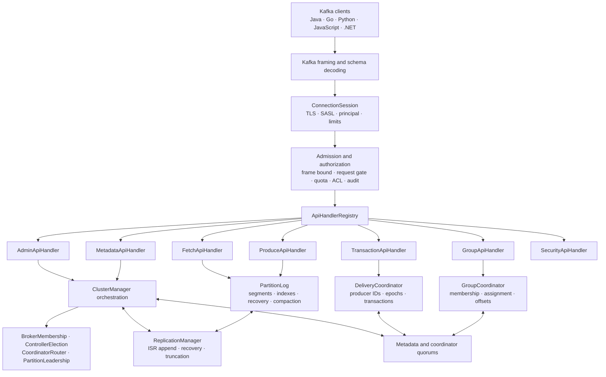
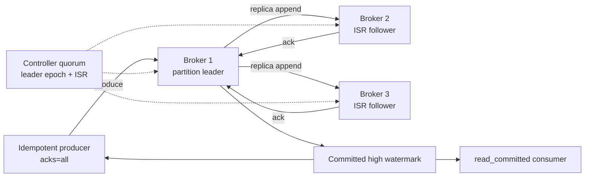
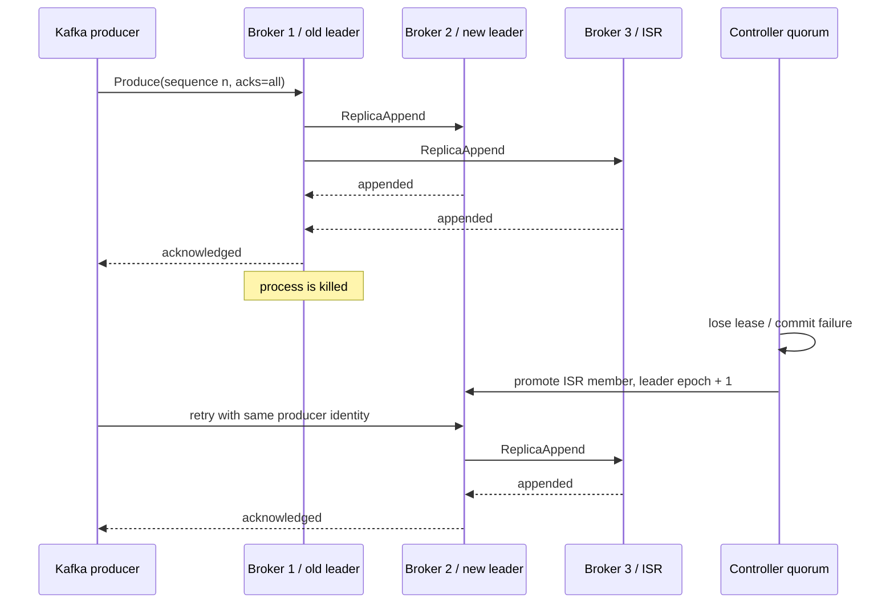

# Cascade architecture

I keep this document close to the code so the diagrams describe the current implementation rather than a future target.

## Internal request path

The handler registry owns API-key routing. Domain handlers expose a narrow dispatch contract; protocol methods still share one broker context so authentication, authorization, metadata, and acknowledgement decisions use the same request/session state.

`ClusterManager` remains the lifecycle facade for the cluster, while deterministic policy is split into independently tested membership, election, routing, and partition-leadership components. Network replication remains in `ReplicationManager`; coordinator persistence and voting live under `cascade.coordinator`.

## Three-node replication and leader failover

An `acks=all` response is sent only after the configured minimum ISR is present and every current ISR member appends. The committed high watermark advances separately from local log end. After failure, only an in-sync replica can be promoted; the new epoch fences stale leaders. Returning replicas compare offsets and truncate divergent data before ISR admission.

## Durable state ownership

| State | Owner | Durability boundary |
| --- | --- | --- |
| Record batches | `PartitionLog` | Segment append plus configured force policy |
| Committed offsets and group membership | Group coordinator shards | Majority-forced shard quorum records |
| Producer epochs, transactions, outcomes | Delivery coordinator shards | Majority-forced shard quorum records |
| Topics, replicas, ISR, leaders, membership | Metadata quorum | Majority metadata commit |
| Controller vote and term | `ControllerStateStore` | Forced CRC32C journal |
| High watermarks | Partition checkpoint | Double-buffered checksum-protected checkpoint |

## Important boundaries

- Public Kafka traffic and authenticated peer RPCs use different API ranges and authorization paths.
- Immutable acknowledged views serve reads while mutations prepare and commit.
- Group and transaction shards lock in sorted order for atomic multi-shard changes.
- Quota-limited requests reserve against the active controller's fenced cluster ledger; zero limits bypass that path.
- Storage acknowledgements, replication acknowledgements, and physical disk forcing are distinct concepts and are documented separately.

